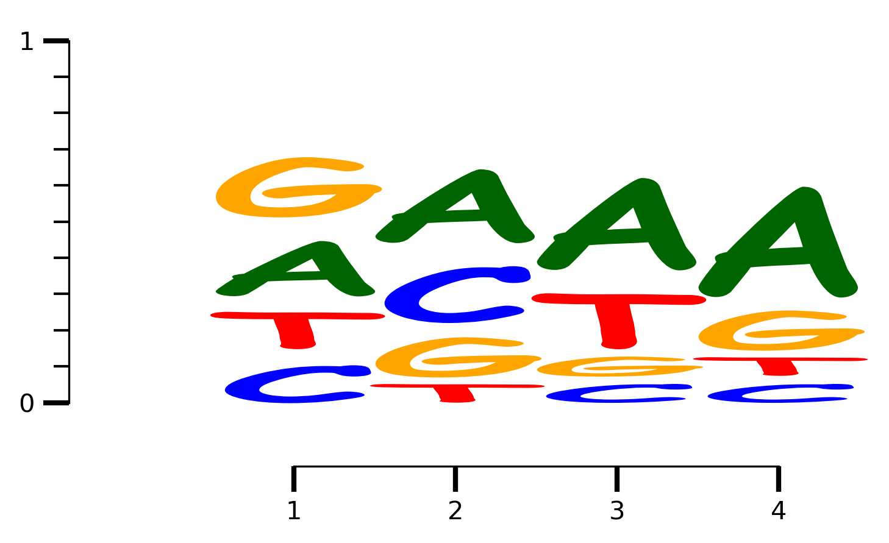

=========
pyseqlogo
=========

.. figure:: https://img.shields.io/pypi/v/pyseqlogo.svg
        :target: https://pypi.python.org/pypi/pyseqlogo

.. figure:: https://img.shields.io/travis/saketkc/pyseqlogo.svg
        :target: https://travis-ci.org/saketkc/pyseqlogo

.. figure:: https://pyup.io/repos/github/saketkc/pyseqlogo/shield.svg
     :target: https://pyup.io/repos/github/saketkc/pyseqlogo/
     :alt: Updates

Python package to plot sequence logos

* Free software: MIT license
* Documentation: http://saketkc.github.io/pyseqlogo

.. code:: python

    from pyseqlogo.pyseqlogo import draw_logo, setup_axis

.. code:: python

    ALL_SCORES1 = [[('C', 0.02247014831444764),
                  ('T', 0.057903843733384308),
                  ('A', 0.10370837683591219),
                  ('G', 0.24803586793255664)],
                 [('T', 0.046608227674354567),
                  ('G', 0.048827667087419063),
                  ('A', 0.084338697696451109),
                  ('C', 0.92994511407402669)],
                 [('G', 0.0),
                  ('T', 0.011098351287382456),
                  ('A', 0.022196702574764911),
                  ('C', 1.8164301607015951)],
                 [('C', 0.020803153636453006),
                  ('T', 0.078011826136698756),
                  ('G', 0.11268374886412044),
                  ('A', 0.65529933954826969)],
                 [('T', 0.017393530660176126),
                  ('A', 0.030438678655308221),
                  ('G', 0.22611589858228964),
                  ('C', 0.45078233627623127)],
                 [('G', 0.022364103549245576),
                  ('A', 0.043412671595594352),
                  ('T', 0.097349627214363091),
                  ('C', 0.1657574733649966)],
                 [('C', 0.03264675899941203),
                  ('T', 0.045203204768416654),
                  ('G', 0.082872542075430544),
                  ('A', 1.0949220710572034)],
                 [('C', 0.0),
                  ('T', 0.0076232429756614498),
                  ('A', 0.011434864463492175),
                  ('G', 1.8867526364762088)],
                 [('C', 0.0018955903000026028),
                  ('T', 0.0094779515000130137),
                  ('A', 0.35637097640048931),
                  ('G', 0.58005063180079641)],
                 [('A', 0.01594690817903021),
                  ('C', 0.017541598996933229),
                  ('T', 0.2774762023151256),
                  ('G', 0.48638069946042134)],
                 [('A', 0.003770051401807444),
                  ('C', 0.0075401028036148881),
                  ('T', 0.011310154205422331),
                  ('G', 1.8624053924928772)],
                 [('C', 0.036479877757360731),
                  ('A', 0.041691288865555121),
                  ('T', 0.072959755514721461),
                  ('G', 1.1517218549109602)],
                 [('G', 0.011831087684038642),
                  ('T', 0.068620308567424126),
                  ('A', 0.10174735408273231),
                  ('C', 1.0009100180696691)],
                 [('C', 0.015871770937774379),
                  ('T', 0.018757547471915176),
                  ('A', 0.32176408355669878),
                  ('G', 0.36505073156881074)],
                 [('A', 0.022798100897300954),
                  ('T', 0.024064662058262118),
                  ('G', 0.24571286522646588),
                  ('C', 0.34070495229855319)]]

Default mode is bits
====================

.. code:: python

    plt.rcParams['figure.dpi'] = 300
    fig, axarr = draw_logo(ALL_SCORES1)
    fig.tight_layout()

.. figure:: examples/output_3_0.png
   :align: center
   :width: 100%
   :figclass: align center

Colorscheme
===========

.. code:: python

    plt.rcParams['figure.dpi'] = 300
    fig, axarr = draw_logo(ALL_SCORES1, data_type='bits', colorscheme='meme')
    fig.tight_layout()

.. figure:: docs/images/output_5_0.png
   :align: center
   :width: 100%
   :figclass: align center

Counts as input
===============

.. code:: python

    counts = {'A' : [3,4,5,6], 'C': [2,3,1,1], 'T': [2,1,3,1], 'G': [3,2,1,2]}
    fig, axarr = draw_logo(counts, data_type='counts', yaxis='probability')
    fig.tight_layout()

.. figure:: docs/images/output_7_0.png
   :align: center
   :width: 100%
   :figclass: align center

Different font!
===============

.. code:: python

    fig, axarr = draw_logo(counts, data_type='counts', yaxis='probability', fontfamily='Comic Sans MS')
    fig.tight_layout()

Plot conservation scores
========================

.. code:: python

    ALL_SCORES = [[('G', 0.1),
                  ('A', 0.1),
                  ('C', 0.31312908494534769),
                  ('T', 0.84220926295645249)]] * 4
    stem_scores = np.random.rand(4)
    fig, axarr = draw_logo(ALL_SCORES, data_type='bits', nrow= 2,ncol=1)
    axarr[1,0].stem(range(1, len(ALL_SCORES)+1), stem_scores)
    setup_axis(axarr[1,0], axis='y', majorticks=1, minorticks=0.1)
    fig.tight_layout()

.. figure:: docs/images/output_11_0.png
   :align: center
   :width: 100%
   :figclass: align center

Credits
---------

This package was created with Cookiecutter_ and the `audreyr/cookiecutter-pypackage`_ project template.

.. _notebook: notebooks/Example01.ipynb
.. _Cookiecutter: https://github.com/audreyr/cookiecutter
.. _`audreyr/cookiecutter-pypackage`: https://github.com/audreyr/cookiecutter-pypackage

